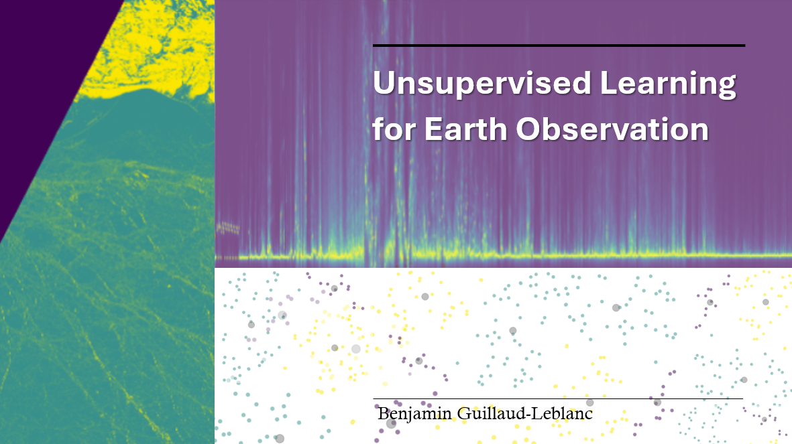

<a id="readme-top"></a>

<!-- PROJECT LOGO -->
<br />
<div align="center">
  <a href="https://github.com/ben-g26/Unsupervised-Learning-Methods">
    
  </a>

<h3 align="center">Unsupervised Classification of Sea Ice and Leads</h3>

  <p align="center">
  <strong>AI for Earth Observation (GEOL0069) - Week 4 | UCL Earth Sciences</strong>
    <br />
  Differentiating sea ice and leads using K-Means, GMM, and AWI-based radar alignment
  <br/>
    <a href="https://github.com/eemeleems/GEOL0069_W4_unsupervised"><strong>Explore the docs »</strong></a>
    <br />
    <br />
 
  </p>
</div>


<!-- TABLE OF CONTENTS -->
<details>
  <summary>Table of Contents</summary>
  <ol>
    <li>
      <a href="#project-summary">Project Summary</a>
      <ul>
        <li><a href="#sentinel-2-and-sentinel-3-data">Sentinel-2 & Sentinel-3 Data</a></li>
        <li><a href="#unsupervised-learning-models">Unsupervised Learning Models</a></li>
        <li><a href="#k-means-clustering">K-Means Clustering</a></li>
        <li><a href="#gaussian-mixture-models">Gaussian Mixture Models (GMM)</a></li>
        <li><a href="#avi-alignment">AVI Alignment</a></li>
      </ul>
    </li>
    <li>
      <a href="#getting-started">Getting Started</a>
      <ul>
        <li><a href="#prerequisites-installation">Prerequisites & Installation</a></li>
      </ul>
    </li>
    <li><a href="#contact">Contact</a></li>
    <li><a href="#acknowledgments">Acknowledgments</a></li>
  </ol>
</details>


<!-- ABOUT THE PROJECT -->
# Project Summary

As polar environments undergo rapid climatic change, monitoring the spatial distribution of sea ice (floating frozen seawater) and leads (linear openings within the ice) is critical for understanding ocean–atmosphere heat exchange and ensuring safe navigation. Image processing techniques are essential for distinguishing these features, and unsupervised machine learning provides an effective solution.

This project explores two unsupervised machine learning approaches to classify sea ice and leads from satellite imagery. Sentinel-2 optical (MSI) and Sentinel-3 altimetry (SRAL) datasets are used, with results compared against European Space Agency (ESA) reference data.

<p align="right">(<a href="#readme-top">back to top</a>)</p>

## Sentinel-2 and Sentinel-3 Data

Sentinel-2 and Sentinel-3 are Earth observation missions developed under the European Space Agency (ESA) Copernicus Programme. This project combines optical imagery with radar altimetry data, enabling a multi-sensor approach that enhances classification performance, particularly in conditions where optical data is limited (e.g., cloud cover).

Read more about the missions here: [Sentinel-2](https://dataspace.copernicus.eu/data-collections/copernicus-sentinel-missions/sentinel-2) & [Sentinel-3](https://dataspace.copernicus.eu/explore-data/data-collections/sentinel-data/sentinel-3)

You can also read more about the relevant instruments from the missions here: [Sentinel-2 MSI](https://www.earthdata.nasa.gov/data/instruments/sentinel-2-msi) & [Sentinel-3 Altimetry Data Guide](https://user.eumetsat.int/resources/user-guides/sentinel-3-altimetry-level-1-data-guide).

<br/>


## Unsupervised Learning Models

Unsupervised learning refers to machine learning techniques that operate without labelled data. Instead of relying on predefined classes, these models identify patterns by grouping similar observations and revealing underlying structure within the dataset.

These approaches are particularly well suited to large and complex datasets. Clustering methods can be categorised into several types, including exclusive ("hard"), overlapping ("soft"), hierarchical, and probabilistic clustering.

<br/>

**There are many unsupervised learning algorithms, and in this project we focus on two:**

* K-Means Clustering (Exclusive Clustering)
* Gaussian Mixture Models (GMM) (Probabilistic Clustering)

<br/>

### K-Means Clustering
K-means clustering is a centroid-based method that partitions data into *k* clusters by minimising within-cluster variance (inertia). The value of *k* is specified in advance. The algorithm assigns each data point to the nearest centroid while iteratively updating centroid positions to reduce cluster spread.

<br/>

**K-means clustering is particularly well-suited for applications where:**

* The underlying data structure is unknown: No prior assumptions about distribution are required, making it useful for exploratory analysis.
* Simplicity and scalability are important: The algorithm is easy to implement and performs efficiently on large datasets.

<br/>

**Components of K-Means:**

* Choosing K: The number of clusters (*k*) must be defined before running the algorithm.
* Centroid Initialisation: The starting positions of centroids can influence the final clustering outcome.
* Assignment Step: Each data point is assigned to the nearest centroid using squared Euclidean distance.
* Update Step: Centroids are recalculated as the mean of all assigned points.

The assignment and update steps are repeated until centroid movement becomes negligible, indicating convergence (often to a local optimum).

<br/>

**Advantages of K-Means:**

* High computational efficiency
* Results are straightforward to interpret

<p align="right">(<a href="#readme-top">back to top</a>)</p>

### Gaussian Mixture Models (GMM)
Gaussian Mixture Models (GMM) represent data as a mixture of multiple Gaussian distributions, each characterised by its own mean and variance. This probabilistic framework assumes that the overall dataset consists of several normally distributed subpopulations.

GMMs are widely used for clustering and density estimation, as they can approximate complex distributions through combinations of simpler Gaussian components.

<br/>

**Gaussian Mixture Models are particularly powerful in scenarios where:**

* Soft clustering is required: Each data point is assigned a probability of belonging to each cluster rather than a single label.
* Flexible cluster shapes are needed: GMM allows clusters to vary in size, shape, and orientation through different covariance structures.

<br/>

**Key Components of GMM:**

* Number of Components (Gaussians): The number of distributions must be specified.
* Expectation-Maximization (EM) Algorithm: Used to iteratively estimate model parameters.
* Covariance Type: Defines the geometry of clusters (e.g., spherical, diagonal, tied, full).

<br/>

**The Expectation-Maximization (EM) algorithm is a two-step process:**

* Expectation Step (E-step): Estimate the probability that each data point belongs to each component.
* Maximization Step (M-step): Update the parameters (means, covariances, and mixing coefficients) to maximise likelihood.

This process repeats until parameter updates become minimal.

<br/>

**Advantages of GMM:**

* Provides probabilistic (soft) clustering
* Adapts to non-spherical cluster shapes

<p align="right">(<a href="#readme-top">back to top</a>)</p>

### AWI Alignment

Radar altimetry measurements are sensitive to orbital tracking errors and variations in Mean Sea Surface (MSS). To improve feature extraction and reliability, a sub-pixel waveform alignment approach based on the Alfred Wegener Institute (AWI) methodology is applied.

Using FFT (Fast Fourier Transform) oversampling, waveforms are aligned to a common reference. This reduces noise in Peakiness and SSD metrics and improves separation between ice and lead clusters in feature space.

<p align="right">(<a href="#readme-top">back to top</a>)</p>

<!-- GETTING STARTED -->
# Getting Started

This project is designed to run in Google Colab, a cloud-based platform for writing and executing Python code. Colab provides access to the computational resources required to process large NetCDF and raster satellite datasets and integrates easily with Google Drive.

It is also possible to run the code locally. In this case, file paths must be adapted from Google Drive references to local directories to access Copernicus Sentinel data. The notebook can be accessed via the Google Colab link in the `.ipynb` file included in the repository.

<p align="right">(<a href="#readme-top">back to top</a>)</p>

## Prerequisites & Installation

Code for installing required packages is included in the notebook.

**Necessary Packages for this Project:**
   
```sh
!pip install rasterio
!pip install netCDF4
import rasterio
import numpy as np
import matplotlib.pyplot as plt
from netCDF4 import Dataset
from scipy.interpolate import interp1d
from scipy.optimize import curve_fit

from sklearn.cluster import KMeans
from sklearn.mixture import GaussianMixture
from sklearn.preprocessing import StandardScaler
from sklearn.metrics import confusion_matrix, ConfusionMatrixDisplay, classification_report
from numpy import asarray as ar, exp
```

<br/>

The Optical (Sentinel-2) and Altimetry (Sentinel-3) data were accessed using the Copernicus Data Store
. Access requires creating an account and authenticating within your code.

Before completing the notebook, ensure Sentinel-2 and Sentinel-3 data are extracted and colocated following the steps provided here: Colocating Sentinel Data
.

* Sentinel-2 (MSI) data : S2A_MSIL1C_20190301T235611_N0207_R116_T01WCU_20190302T014622.SAFE

* Sentinel-3 (SRAL) data : S3B_SR_2_LAN_SI_20190301T231304_20190301T233006_20230405T162425_1021_022_301______LN3_R_NT_005.SEN3

<p align="right">(<a href="#readme-top">back to top</a>)</p>

<!-- CONTACT -->
# Contact
Benjamin Guillaud-Leblanc - [LinkedIn](https://www.linkedin.com/in/benjamin-guillaud-leblanc-b168b723a/) - ben.guillaud-leblanc.22@ucl.ac.uk

Project Link: [https://github.com/ben-g26/Unsupervised-Learning-Methods](https://github.com/ben-g26/Unsupervised-Learning-Methods)

<p align="right">(<a href="#readme-top">back to top</a>)</p>


<!-- ACKNOWLEDGMENTS -->
# Acknowledgments

* This project makes up my Week 4 assignment for GEOL0069 Artificial Intelligence for Earth Observation (25/26) at University College London.
* Thank you to [Prof. Michel Tsamados](https://profiles.ucl.ac.uk/11855-michel-tsamados) and [Weibin Chen](https://www.ucl.ac.uk/mathematical-physical-sciences/weibin-chen) for producing the initial Jupyter Notebook for this project and their guidance in AI for Earth Observation.
* Thank you to [ESA/Copernicus](https://cds.climate.copernicus.eu/) for the availability of Sentinel-2 and Sentinel-3 data.
* Thank you to [AWI (Alfred Wegner Institute)](https://www.awi.de/en/) for the methodology regarding radar re-tracking.


<p align="right">(<a href="#readme-top">back to top</a>)</p>

